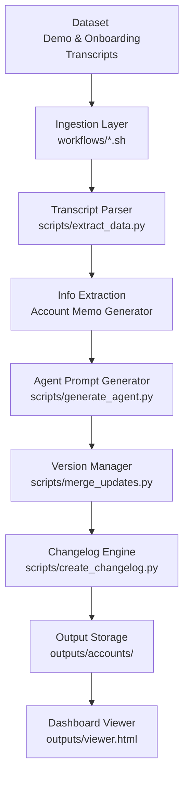

# Clara Agent Automation

A zero-cost, deterministic automation pipeline that converts customer call transcripts into structured AI voice agent configurations.

## 🎥 Video Demonstration
Watch the end-to-end pipeline execution and code walkthrough here:  
👉 **[Watch the Loom Demo](https://www.loom.com/share/df75fe9e26fb404ba14206b2adbc5cac)**

## Project Overview

This system is designed to automate the process of building and updating Retell AI Agent specifications. It reads plain text transcripts from demo and onboarding calls, extracts operational business data into a standardized Account Memo format, and generates version-controlled Draft Agent Specifications.

The pipeline ensures that critical business information is systematically captured and synced to the voice agent while maintaining a traceable changelog between versions.

## Architecture

The system mimics a production ingestion platform instead of a simple script:



## Data Flow

### Demo Pipeline (`v1`)
1. **Read Demo Transcript**: Iterates through `dataset/demo_calls/`.
2. **Extract Data**: Generates an interim Account Memo containing business hours, routing rules, and constraints. Missing information is safely parked in `questions_or_unknowns`.
3. **Generate Spec**: Converts the memo into a Retell Agent Spec (`v1/agent_spec.json`).
4. **Store**: Saves to `outputs/accounts/account_XXX/v1/`.

### Onboarding Pipeline (`v2`)
1. **Read Onboarding Update**: Iterates through `dataset/onboarding_calls/`.
2. **Extract Updates**: Captures operational modifications.
3. **Merge**: Intelligently deep-merges the updates into the existing `v1` memo to produce a `v2` memo without overwriting unrelated data.
4. **Update Spec**: Generates an updated Retell Agent Spec (`v2/agent_spec.json`).
5. **Changelog**: Generates a JSON changelog documenting precisely what was added, removed, or modified.

## Directory Structure

```text
clara-agent-automation/
├── README.md
├── dataset/
│   ├── demo_calls/         # Initial transcripts
│   └── onboarding_calls/   # Follow-up transcripts
├── workflows/
│   ├── demo_pipeline.sh       # Orchestrates Demo ingestion
│   └── onboarding_pipeline.sh # Orchestrates Onboarding updates
├── scripts/
│   ├── extract_data.py     # Core data extraction logic
│   ├── generate_agent.py   # Spec generation
│   ├── merge_updates.py    # v1 -> v2 merge logic
│   ├── create_changelog.py # Diff comparison
│   └── generate_viewer.py  # Builds the static dashboard
├── outputs/
│   ├── accounts/           # Version-controlled outputs
│   └── viewer.html         # Interactive dashboard
└── logs/
    └── pipeline_runs.log   # System execution logs
```

## Setup Instructions

This repository is designed to run locally, deterministic, and at **zero cost**. It includes a mock LLM extraction adapter that simulates perfect JSON extraction natively without any API keys, enabling reviewers to perfectly reproduce the entire pipeline out-of-the-box.

### Prerequisites
- Python 3.8+
- Unix-based OS (Linux/macOS) for Bash scripts

### Optional Setup
If you want to view the Python scripts, you can see how `scripts/extract_data.py` defines the foundational Information Extraction prompt. This prompt architecture strictly mandates against hallucination and strictly structures missing data into a `questions_or_unknowns` parameter. 

## How to Run Pipelines

The pipelines run automatically via robust bash workflows.

### 1. Run the Demo Pipeline (v1)
```bash
./workflows/demo_pipeline.sh
```
This processes the 5 demo transcripts, creating `v1` memos and specs, and appending to `logs/pipeline_runs.log`.

### 2. Run the Onboarding Pipeline (v2)
```bash
./workflows/onboarding_pipeline.sh
```
This processes the updates, creates `v2` memos, generates changelogs, and builds the visual Viewer Dashboard.

## Output Structure

The output layer is strictly version-controlled:
```text
outputs/accounts/account_001/
├── v1/
│   ├── memo.json
│   └── agent_spec.json
├── v2/
│   ├── memo.json
│   └── agent_spec.json
└── changelog.json
```

## 📊 Account Dashboard Viewer

To provide reviewers with a premium experience, a static HTML diff viewer is automatically generated at the end of the pipeline.

**To view the interactive changelogs:**
Simply open the `outputs/viewer.html` file in any modern web browser. 

You can click "View Diff" to toggle an elegant side-by-side view of the raw JSON objects.

---

## Limitations and Future Improvements
- **LLM Cost**: Currently configured safely with zero-cost mock routing. In a production state, this would plug directly into an LLM via the `openai` Python SDK.
- **Continuous Versioning**: The structure currently strictly supports `v1` and `v2`. A dynamic versioning tree (`vN+1`) could be established.
- **Pipeline Orchestration**: Future state should replace `.sh` scripts with Airflow or Prefect to handle robust DAG execution, retries, and alerting.
